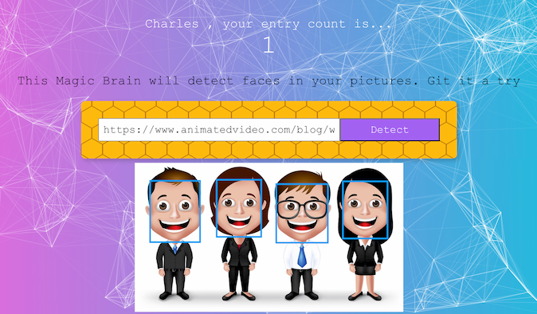

## Face Detection App : Back-End

### Source code for the Back-End (click [here](https://fd-smart-brain.herokuapp.com/) to see the web site)

### Technologies

  - JavaScript, HTML, CSS
  - Node.js
  - Express.js
  - Knex.js (SQL query builder)
  - PostgreSQL
  - Face recognition API (clarifai.com)

